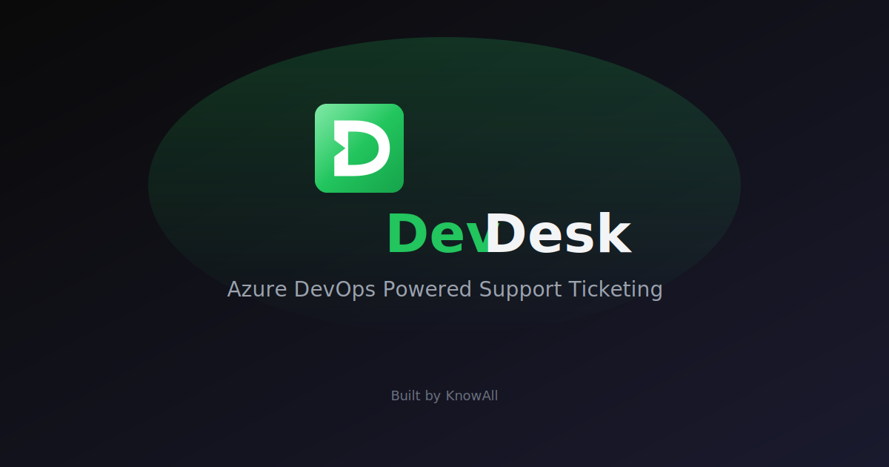

<p align="center">
  <a href="https://zapdesk.knowall.ai">
    
  </a>
</p>

<p align="center">
  <picture>
    <source media="(prefers-color-scheme: dark)" srcset="public/assets/logo.svg">
    <source media="(prefers-color-scheme: light)" srcset="public/assets/logo-light.svg">
    
  </picture>
</p>

<p align="center">
  <strong>Azure DevOps Powered Support Ticketing</strong>
</p>

<p align="center">
  <a href="https://zapdesk.knowall.ai">Production</a> •
  <a href="#quick-start">Quick Start</a> •
  <a href="#features">Features</a> •
  <a href="docs/SOLUTION_DESIGN.adoc">Documentation</a>
</p>

---

**ZapDesk** is a Zendesk-style support ticketing portal that uses Azure DevOps as its backend. Built by [KnowAll](https://www.knowall.ai).

## Features

- **Microsoft Authentication** - Sign in with Azure AD/Microsoft accounts
- **Azure DevOps Integration** - Work items tagged as "ticket" appear as support tickets
- **Multi-tenant Support** - Different clients have different DevOps projects (e.g., Medite, Cairn Homes)
- **Permission-based Access** - Users only see tickets from projects they have access to
- **Email-to-Ticket** - Send emails to a configured mailbox to create tickets automatically
- **Email Responses** - Replies to tickets email the requester via Exchange Online
- **Zendesk-like UI** - Familiar interface with views, filters, and ticket management

## Quick Start

### Prerequisites

- [Node.js](https://nodejs.org/) 20+ (runtime for the server)
- [Bun](https://bun.sh) 1.2+ (package manager)
- Azure DevOps organization
- Azure AD application for authentication
- Exchange Online mailbox (for email integration)

### Installation

1. **Clone the repository**

   ```bash
   git clone https://github.com/knowall-ai/zapdesk.git
   cd zapdesk
   ```

2. **Install dependencies**

   ```bash
   bun install
   ```

3. **Configure environment variables**

   ```bash
   cp .env.example .env
   ```

   Edit `.env` with your values (see [.env.example](.env.example))

4. **Run the development server**

   ```bash
   bun run dev
   ```

5. **Open the application**
   Navigate to [http://localhost:3000](http://localhost:3000)

## Azure AD Setup

1. Register a new application in Azure AD
2. Add redirect URIs:
   - Development: `http://localhost:3000/api/auth/callback/azure-ad`
   - Production: `https://zapdesk.knowall.ai/api/auth/callback/azure-ad`
3. Configure API permissions for Azure DevOps:
   - `499b84ac-1321-427f-aa17-267ca6975798/.default` (Azure DevOps)
4. Create a client secret and note it down

## How It Works

### Ticket Tagging

Only Azure DevOps work items with the **"ticket"** tag will appear in ZapDesk. To convert any work item into a support ticket:

1. Open the work item in Azure DevOps
2. Add the tag "ticket"
3. The item will now appear in ZapDesk

### Project Mapping

ZapDesk maps Azure DevOps projects to organizations/clients:

| Project     | Domain         | Description                |
| ----------- | -------------- | -------------------------- |
| Medite      | medite.com     | Medite client project      |
| Cairn Homes | cairnhomes.com | Cairn Homes client project |
| KnowAll     | knowall.ai     | Internal KnowAll project   |

## Email Integration

### Inbound Email (Creating Tickets)

Customers send emails to the configured support mailbox to create tickets:

1. Set up an Exchange Online shared mailbox
2. Configure mail flow rule to forward to webhook
3. Or use Power Automate to POST to `/api/email/webhook`

### Outbound Email (Responses)

When agents reply to tickets, the requester receives an email:

1. Configure Exchange Online SMTP settings
2. Set `SMTP_*` environment variables
3. Replies include ticket reference for threading

### Exchange Online Setup

1. **Create shared mailbox** for your support email address
2. **Enable SMTP AUTH** for the mailbox
3. **Create app password** or configure OAuth
4. **Set up mail flow rules** for inbound processing

See [docs/EMAIL_SETUP.adoc](docs/EMAIL_SETUP.adoc) for detailed instructions.

## Tech Stack

- **Framework**: Next.js 16 (App Router)
- **Runtime**: Node.js (production), Bun (local development)
- **Package Manager**: Bun
- **Language**: TypeScript
- **Styling**: Tailwind CSS 4
- **Authentication**: NextAuth.js with Azure AD
- **Backend**: Azure DevOps REST API
- **Icons**: Lucide React
- **Deployment**: Azure App Service

## Project Structure

```
zapdesk/
├── src/
│   ├── app/                    # Next.js app router pages
│   │   ├── api/               # API routes
│   │   │   ├── auth/          # NextAuth endpoints
│   │   │   ├── devops/        # DevOps API proxy
│   │   │   └── email/         # Email webhook
│   │   ├── tickets/           # Ticket pages
│   │   ├── customers/         # Customer pages
│   │   ├── organizations/     # Organization pages
│   │   └── login/             # Login page
│   ├── components/            # React components
│   ├── lib/                   # Utility functions
│   └── types/                 # TypeScript types
├── docs/                      # Documentation
├── tests/                     # Playwright tests
└── public/                    # Static assets
```

## Documentation

- [Solution Design](docs/SOLUTION_DESIGN.adoc)
- [Deployment Guide](docs/DEPLOYMENT.adoc)
- [Testing Guide](docs/TESTING.adoc)
- [Troubleshooting](docs/TROUBLESHOOTING.adoc)

## Development

```bash
# Run development server
bun run dev

# Build for production
bun run build

# Run production server
bun run start
```

### Code Quality Checks

The following checks run automatically on every pull request via GitHub Actions:

```bash
# Run all checks (recommended before pushing)
bun run check

# Individual checks
bun run typecheck      # TypeScript type checking
bun run lint           # ESLint
bun run lint:fix       # ESLint with auto-fix
bun run format:check   # Prettier format check
bun run format         # Prettier auto-format

# Run tests
bun run test
```

All checks must pass before a PR can be merged.

## License

Proprietary - KnowAll AI Ltd.

## Support

For support, email [support@knowall.ai](mailto:support@knowall.ai) or visit [knowall.ai](https://www.knowall.ai).
